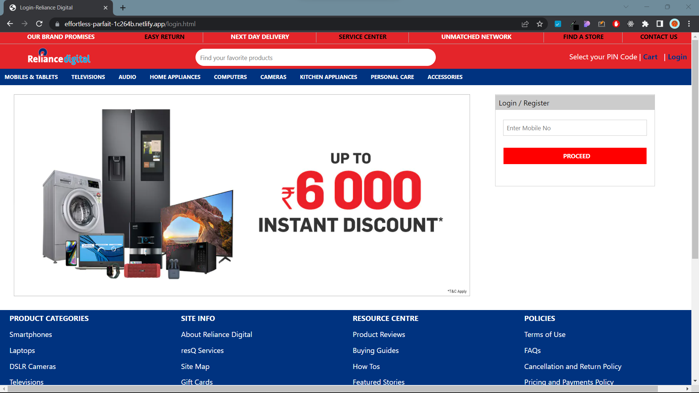

# Clone of relianceDigita.in

 
 
 

# What is relianceDigital?

Network of 400+ stores nationally, housing over 200 brands and 5000 products. From in-depth, expert buying advice to personal after-sales care tailored to each customer, they commit to our promise of 'Personalising Technology' every day.

As per their commitment to making technology readily accessible across the country, Reliance Digital offers a flexible shopping experience, seamlessly combining our online presence with our physical stores.
Customers shopping online at www.reliancedigital.in can choose to immediately pick up their order from their nearest store with our Pick Up at Store feature or choose Express Delivery, to receive their product within 48 hours.
Customers can also choose from a variety of flexible payment options including debit and credit cards, cash-on-delivery, UPI, online wallets and EMI options

# What have we done?

We have tried to clone the whole website with the team of 4.
Team Members: Shagun Sharma, Manish Sonawne, Nikhil Magar, Priyanshu(Me)

# Areas of Responsibility:

Shagun Sharma : Payment Gateway andd Final Order page
Manish Sonawane : Cart Page and Product Page
Nikhil Magar : Product Page
Priyanshu(Me) : Entire HomePage, Navbar, Header, Footer(for all the pages)

# Images

 

